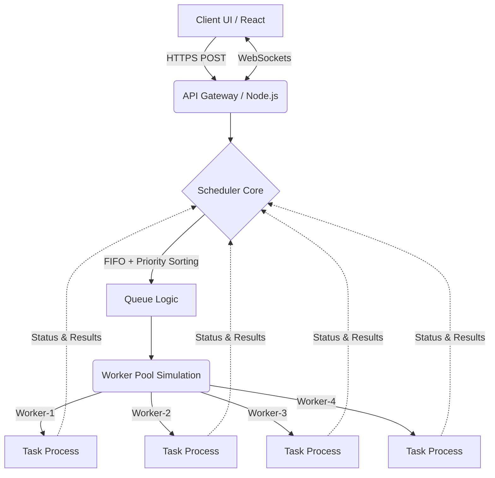

# 🚀 AI-Powered Distributed Inference & Job Scheduling Platform (Mini GPUaaS)

[](https://opensource.org/licenses/MIT)
[](https://www.docker.com/)

## 🧠 Problem Statement
Modern AI systems face a critical bottleneck: handling multiple asynchronous user inference requests using limited, highly expensive computational resources (like GPUs). Users submit inference jobs with varying latency constraints—ranging from real-time Chatbot inferences to slower batch image processing. 

This project solves this by implementing a **GPU-as-a-Service (GPUaaS)** platform. It provides a robust distributed job scheduling ecosystem that ensures low latency for high-priority tasks, prevents resource starvation for lower-tier tasks, and maintains high throughput and fault tolerance across simulated worker nodes.

---

## 🏗️ System Architecture

The ecosystem relies on an intelligent Queue Manager to delegate tasks efficiently across a worker pool mimicking active GPUs.



### Core Components
1. **Frontend (Dashboard):** Real-time React tracking system allowing job injection and monitoring.
2. **API Gateway:** Secure endpoint handling task submission and validation.
3. **Smart Scheduler (Core Logic 🔥):** A priority-based scheduler preventing starvation and honoring Real-Time, High, and Low queues.
4. **Worker Nodes (GPU Simulation):** 4 asynchronous simulated units that pull jobs from the queue dynamically. Includes a failure simulator configured with a crash probability.
5. **Fault Tolerance:** Built-in **Exponential Backoff** retry logic mechanism.

---

## ⚙️ Tech Stack
* **Frontend:** ReactJS, WebSockets (Socket.IO client), Vanilla CSS (Glassmorphism design)
* **Backend:** Node.js, Express, Socket.IO
* **Simulation Engine / Queues:** In-memory highly concurrent object structures mimicking Redis + Celery/BullMQ behaviors.
* **Infrastructure:** Docker & Docker Compose for microservice orchestration.

---

## 📈 Evaluation Metrics Tracked
The system live-tracks essential production-level monitoring variables:
- **Average Processing Latency**
- **Throughput (jobs/sec)**
- **Worker Utilization %**
- **Queue Backpressure Metrics**

---

## 🚀 Setup & Execution 

### Option 1: Docker (Recommended)
This application includes a complete CI/CD-ready Docker footprint.
```bash
git clone https://github.com/your-username/ai-gpu-scheduler.git
cd ai-gpu-scheduler
docker-compose up --build
```
Access the dashboard via `http://localhost:5173`.

### Option 2: Local Node Setup
1. **Initialize Backend API:**
   ```bash
   cd backend
   npm install && npm start
   ```
2. **Initialize Frontend Dashboard (in a new terminal):**
   ```bash
   cd frontend
   npm install && npm run dev
   ```
   *Dashboard loads at `http://localhost:5173`*

---

## 📝 Resume Bullet Points (Copy-Paste Ready)
To clearly articulate the high-level engineering accomplished here:
> 🎯 **Software Engineer | AI Infra Task**
> - *Architected a distributed Job Scheduling macro-service (Mini GPUaaS) executing latency-aware AI inference routing logic using Node.js and WebSockets.*
> - *Engineered a custom priority-based asynchronous queue simulating a standard Redis/Celery queue cluster; actively preventing thread starvation and guaranteeing lower latency routing for higher priority traffic.*
> - *Implemented rigorous fault-tolerance safety nets mitigating simulated node connection drops using Exponential Backoff retry algorithms.*
> - *Containerized the full-stack architecture using Docker Compose, establishing clean microservice separation and CI/CD readiness.*
> - *Developed a dynamic React tracking dashboard with high-refresh telemetry updating throughput statistics, queue lengths, and active worker utilization.*
